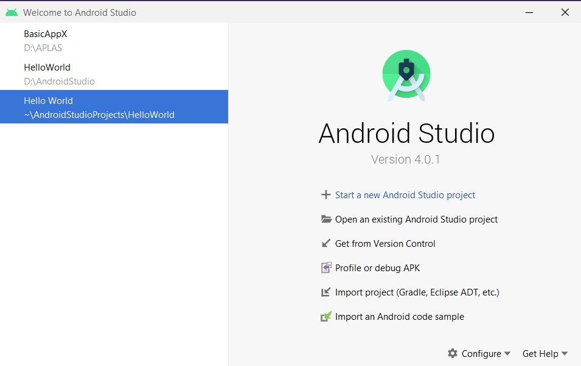
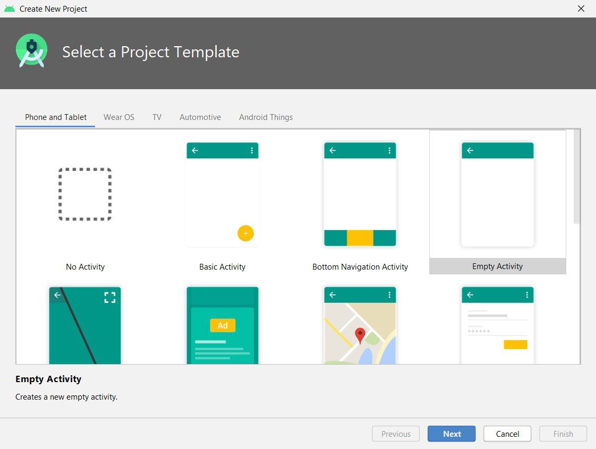
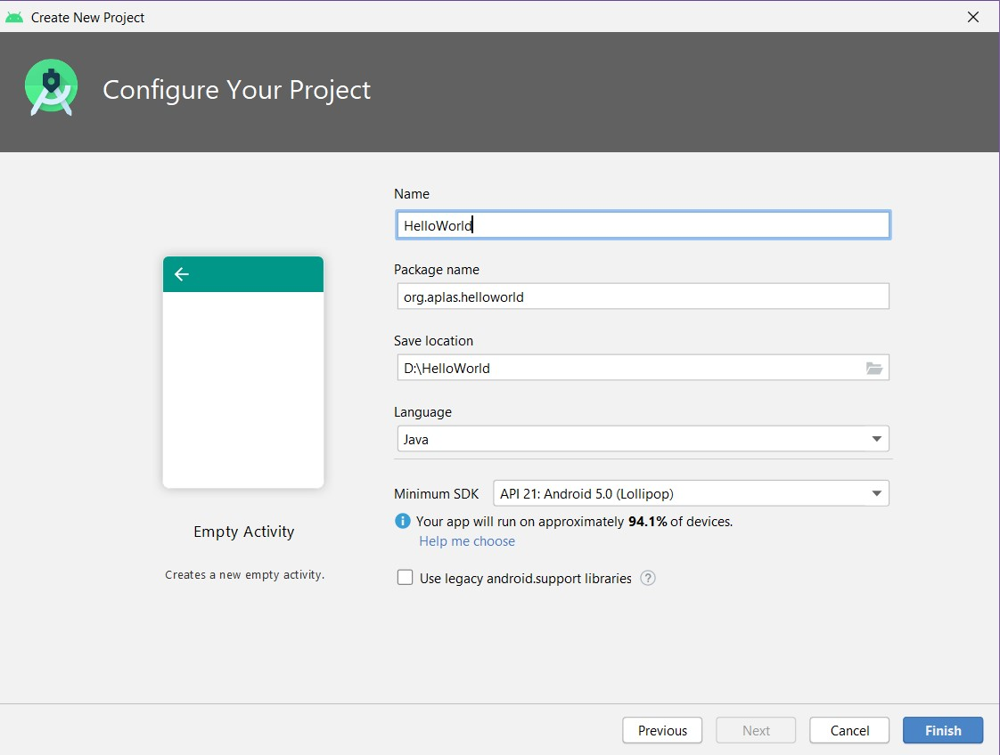
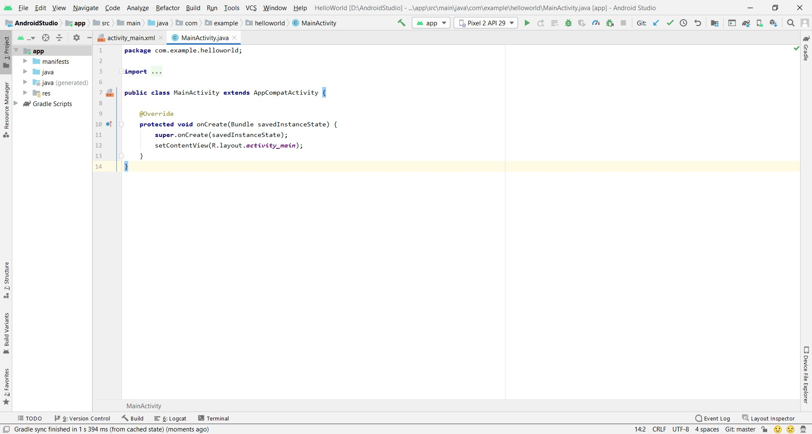
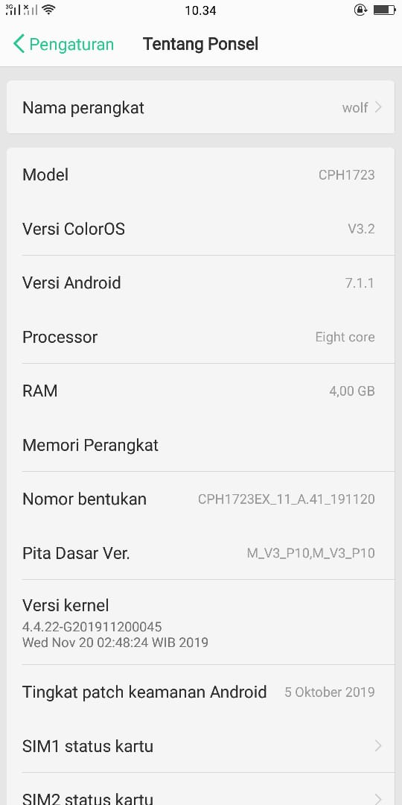
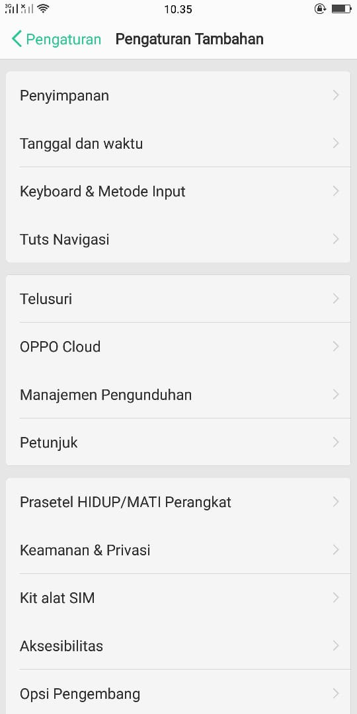
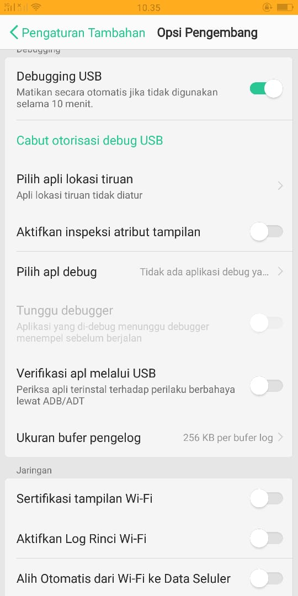
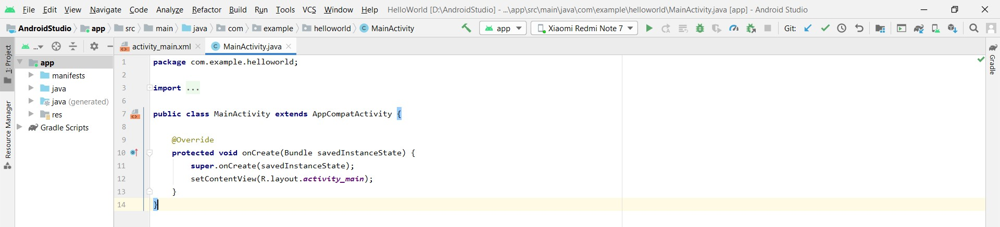

# 01 - Hello World

## Tujuan Pembelajaran

1. Mahasiswa mampu menginstall Android Studio, Android SDK, dan konfigurasi Kotlin.
2. Mahasiswa Mampu menginstall Emulator.
3. Mahasiswa Mampu Menghubungkan Perangkat Mobile Ke Komputer / Laptop.
4. Mahasiswa mampu melakukan instalasi Git dan mengkonfigurasika.

## Langkah-langkah Praktikum

1. Buka Aplikasi Android Studio.
2. Pilih Start New Project.

3. Selanjutnya pilih empty activity lalu klik next.

4. Selanjutnya ubah name, package dan location. Lalu tunggu hingga proses run gradle nya selesai.

5. Selanjutnya jika running gradlenya selesai, akan tampil tampilan seperti gambar dibawah ini.

6. Selanjutnya hubungkan dengan hp android kita masing-masing. Caranya, pertama sambungkan hp dengan menggunakan kabel usb. Lalu ke pengaturan hp dan pilih tentang telepon.

7. Karena hp yang digunakan adalah Redmi Note 7, maka tap versi MIUI sebanyak kurang lebih 7 kali. Tujuannya untuk menjadikan hp nya sebagai developer.
8. Jika sudah menjadi developer, selanjutnya ke menu setelan tambahan yang terdapat di pengaturan.

9. Selanjutnya pilih Opsi Pengembang, dan aktifkan Debugging USB dan Install via USB.

10. Jika android sudah terhubung maka akan tampil merk hp di aplikas Android Studio seperti pada gambar berikut.

11. Selanjutnya jalankan aplikasi HelloWorld nya, dan hasilnya akan terinstall secara otomotasi di hp android kita.

## Hasil Praktikum

(Lampirkan screenshot hasil praktik di sini selengkap mungkin sesuai tujuan pembelajaran yang ingin dicapai)
