# 04 

## Tujuan Pembelajaran

1. Mahasiswa mampu memahami konsep penggunaan View Model pada aplikasi Android.
2. Mahasiswa mampu memahami konsep penggunaan Live Data pada aplikasi Android.
3. Mahasiswa mampu menerapkan konsep ViewModel pada aplikasi Android.
4. Mahasiswa mampu menerapkan konsep LiveData pada aplikasi Android.

## Hasil Praktikum

1. Hasil TestB2AdvancedWidgetsX011
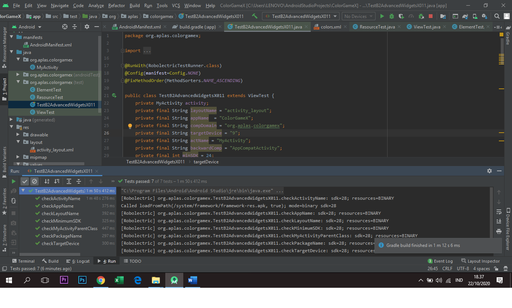

2. Hasil TestA1BasicUIX012
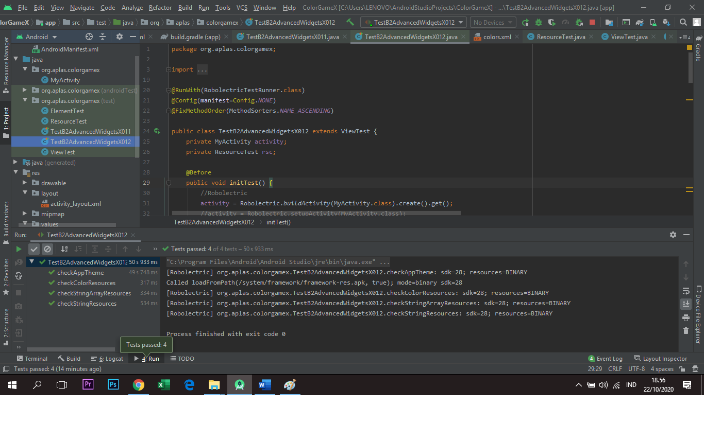

3. Hasil TestB2AdvancedWidgetsX021
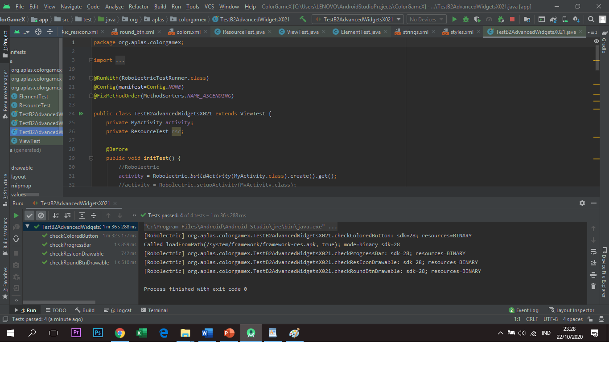

4. Hasil TestB2AdvancedWidgetsX031
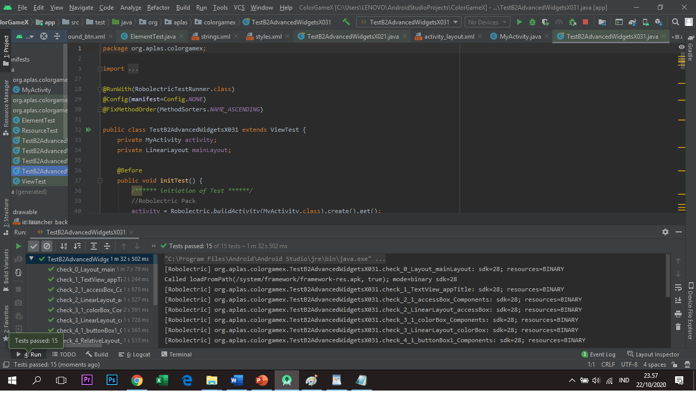

5. Hasil TestB2AdvancedWidgetsX0041

6. Hasil TestB2AdvancedWidgetsX051
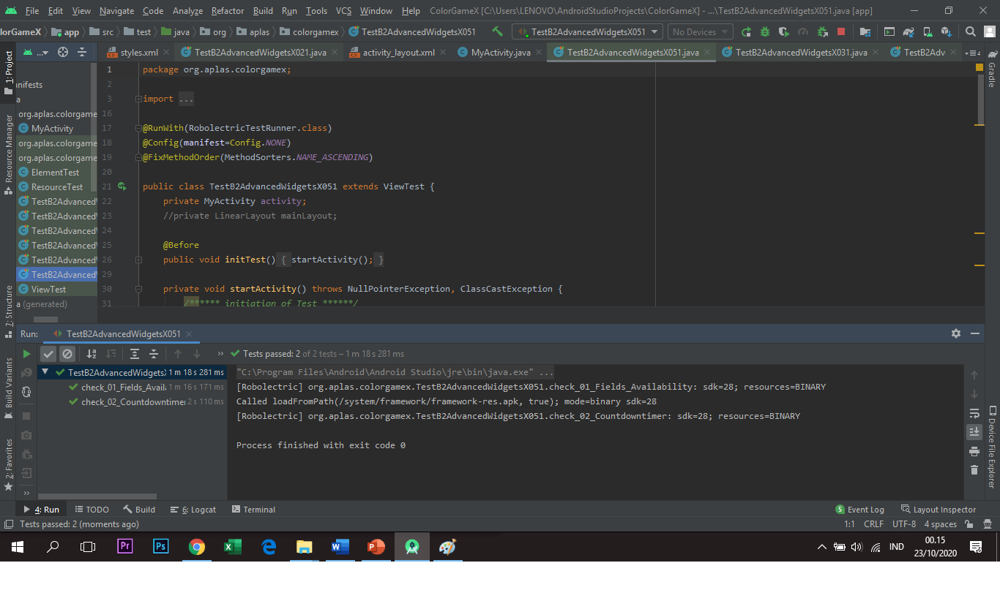

7. Hasil TestB2AdvancedWidgetsX061
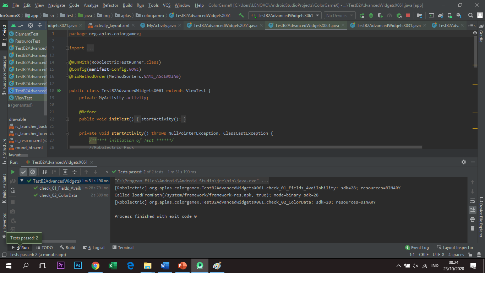

8. Hasil TestB2AdvancedWidgetsX071
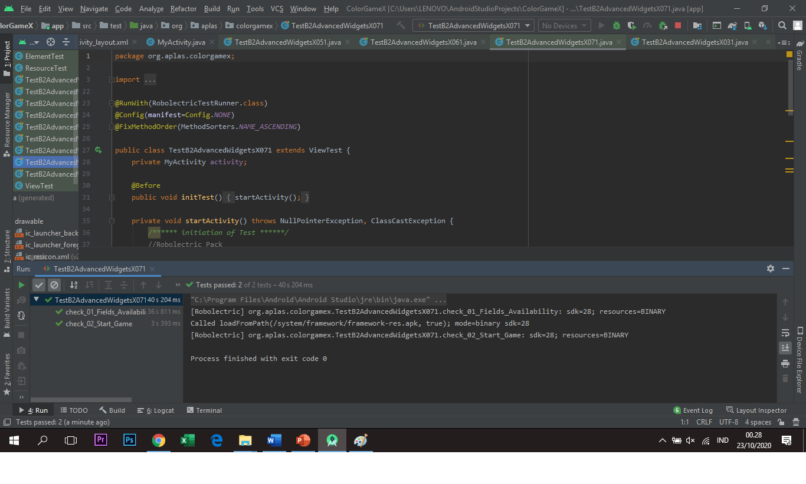

9. Hasil TestB2AdvancedWidgetsX081
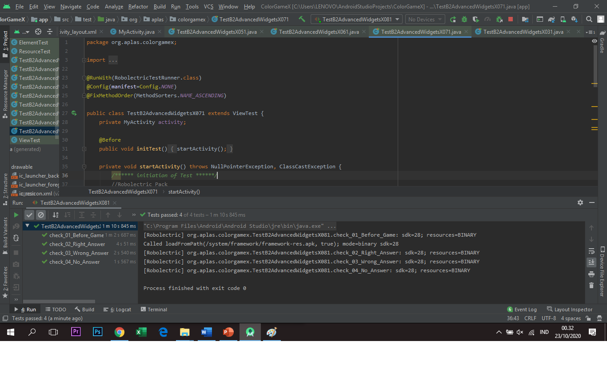

12. Hasil Akhir ColorGameX

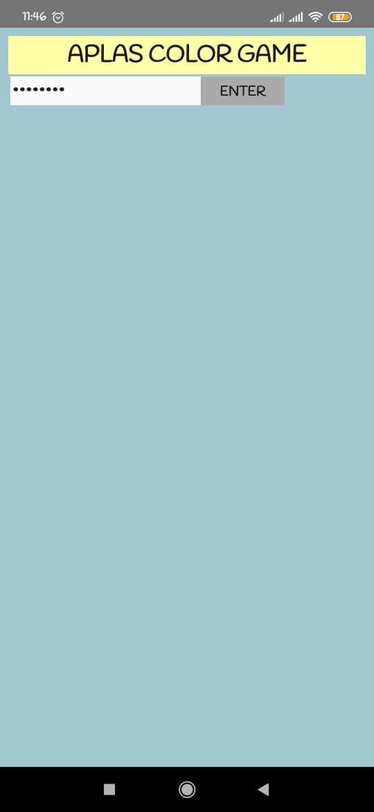
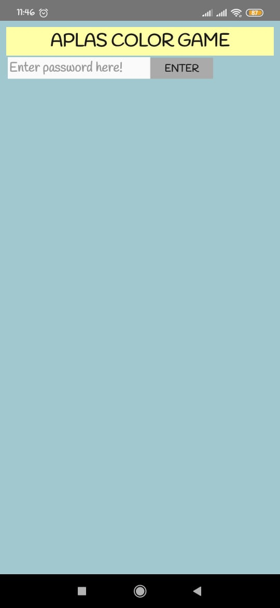
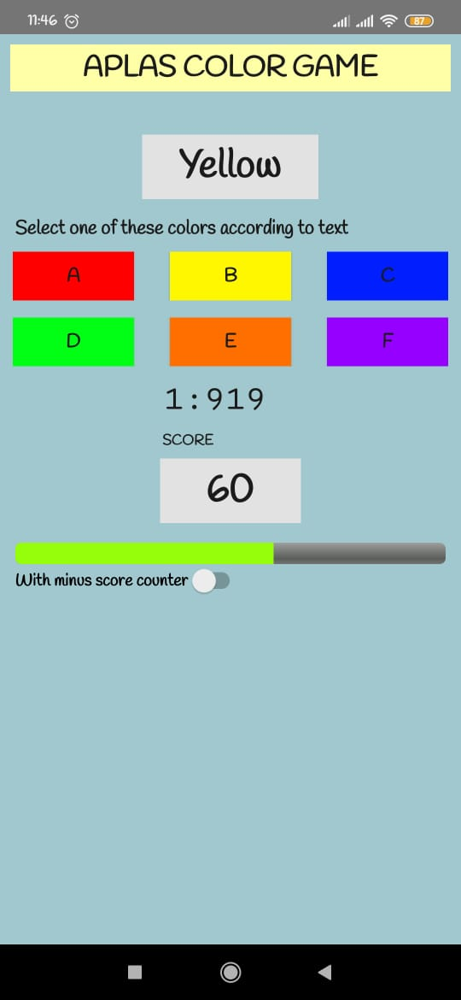
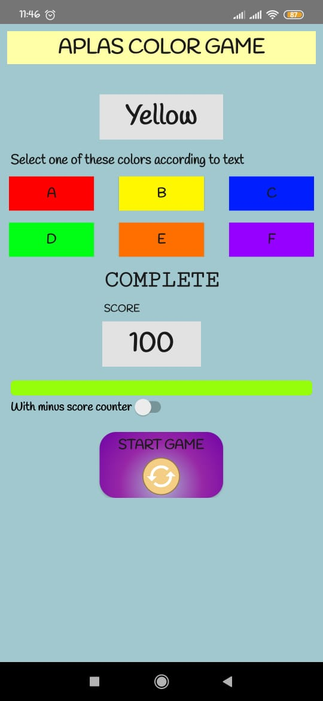

(Lampirkan screenshot hasil praktik di sini selengkap mungkin sesuai tujuan pembelajaran yang ingin dicapai)
