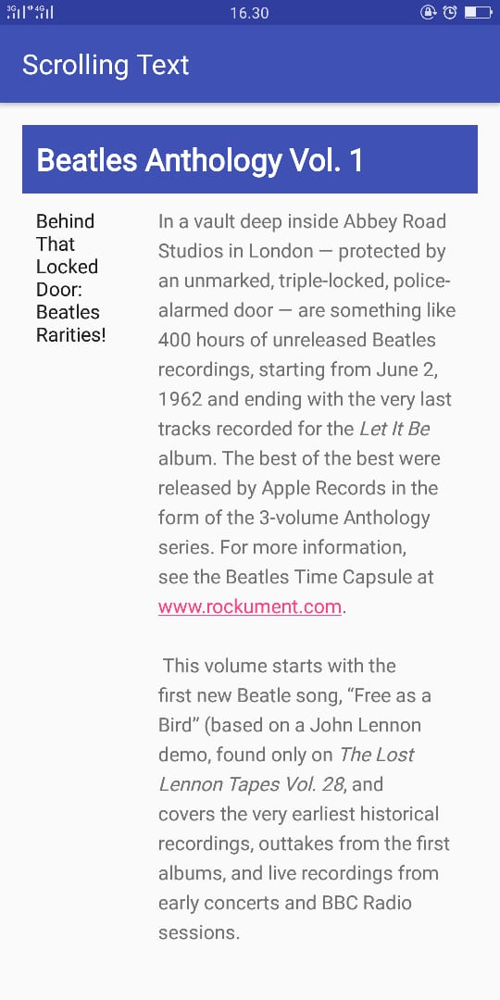
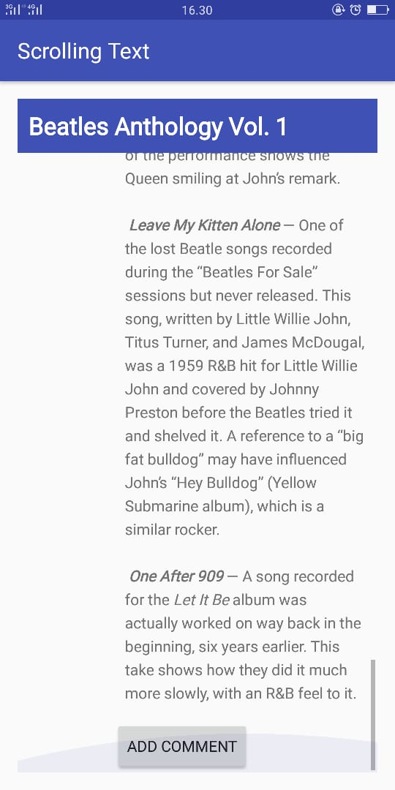

# 05

## Tujuan Pembelajaran

1. Mahasiswa mampu menangani interaksi pengguna.

## Pekerjaan Rumah (HomeWork)

1. Question 1
   How many can you use within a ScrollView? Choose one:
   
   a. One view only
   b. One view or one view group
   c. As many as you need
   
   Answer: b. One view or one view group

2. Question 2
   Which XML attribute do you use in a LinearLayout to show views side by side? Choose one:
   
   a. android:orientation=”horizontal”
   b. android:orientation=”vertical”
   c. android:layout_width=”wrap_content”
   
   Answer: a. android:orientation="horizontal"

3. Question 3
   Which XML attribute do you use to define the width of LinearLayout inside the scrolling view? Choose one:
   
   a. android:layout_width=”wrap_content”
   b. android:layout_width=”match_parent”
   c. android:layout_width=”200dp”
   
   Answer: b. android:layout_width="match_parent"

## Hasil Praktikum

(Lampirkan screenshot hasil praktik di sini selengkap mungkin sesuai tujuan pembelajaran yang ingin dicapai)
