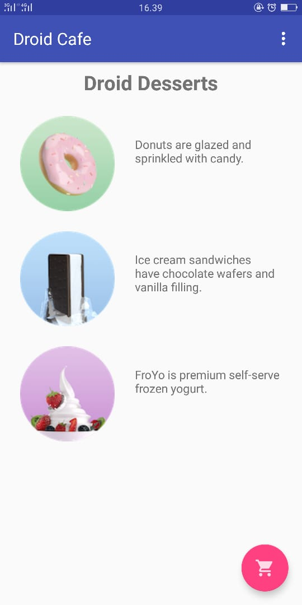
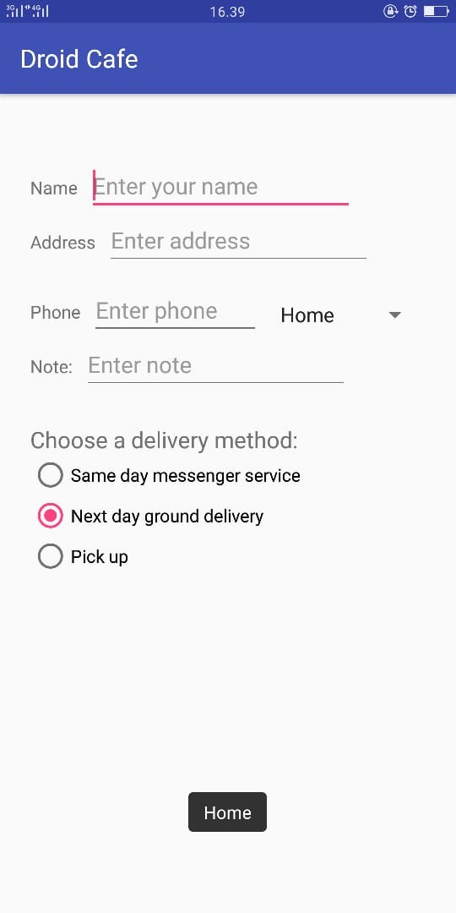

# 06 

## Tujuan Pembelajaran

1. Mahasiswa mampu membuat aplikasi yang menggunakan Input Keyboard.

## Pekerjaan Rumah (HomeWork)

Question 1

What’s the most important difference between checkbox and a RadioGroup of radio buttons? Choose one:

•	The only difference is in how they appear: checkboxes show a checkmark when selected, while circular "radio" buttons appear filled when selected.
•	CheckBox elements in the layout can use the android:onClick attribute to call a handler when selected.
•	The major difference is that checkboxes enable multiple selections, while a RadioGroup allows only one selection.
Answer: The major difference is that checkboxes enable multiple selections, while a RadioGroup allows only one selection.

Question 2

Which layout group lets you align a set of CheckBox elements vertically? Choose one:

•	RelativeLayout
•	LinearLayout
•	ScrollView
Answer: LinearLayout

Question 3

Which one the following is the method of the Checkable interface to check the state of a radio button (that is, whether it has been selected or not)?

•	getId()
•	isChecked()
•	onRadioButtonClicked()
•	onClick()
Answer: isChecked()

1. Mahasiswa mampu membuat aplikasi yang menggunakan Input Keyboard.

## Hasil Praktikum

(Lampirkan screenshot hasil praktik di sini selengkap mungkin sesuai tujuan pembelajaran yang ingin dicapai)
