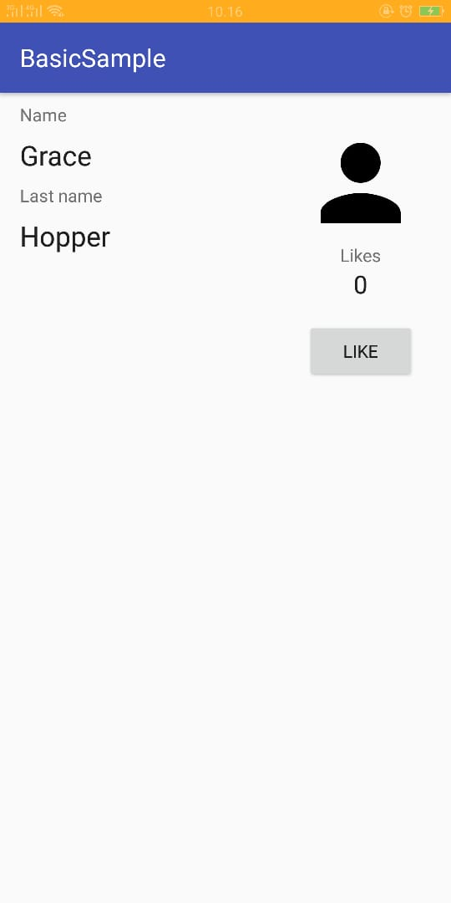
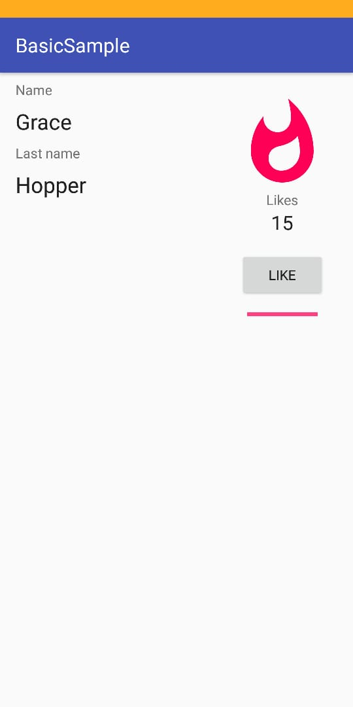

# 07 Databinding 

## Tujuan Pembelajaran

1. Mahasiswa mampu melakukan konfigurasi databinding pada project Android.
2. Mahasiswa mampu menerapkan databinding pada project Android

## Hasil Praktikum

(Lampirkan screenshot hasil praktik di sini selengkap mungkin sesuai tujuan pembelajaran yang ingin dicapai)
