# 08 MultiActivities 

## Tujuan Pembelajaran

1. Mahasiswa mampu mengkonversi multi activity menjadi single activity multi Fragment.
2. Mahasiswa mampu memasang dan menerapkan navigation component.

## Hasil Praktikum

1. Hasil Run TestB3MultiActivities011
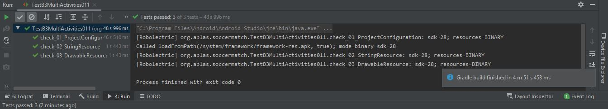

2. Hasil Run TestB3MultiActivities021
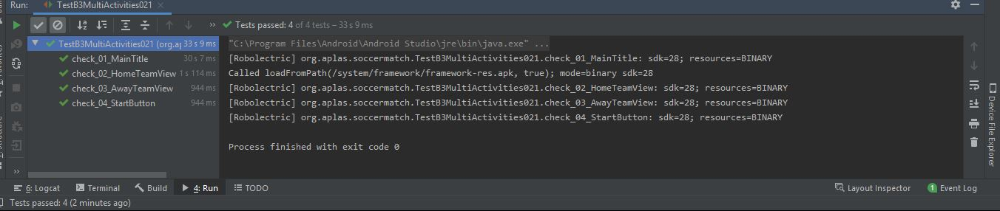

3. Hasil Run TestB3MultiActivities031
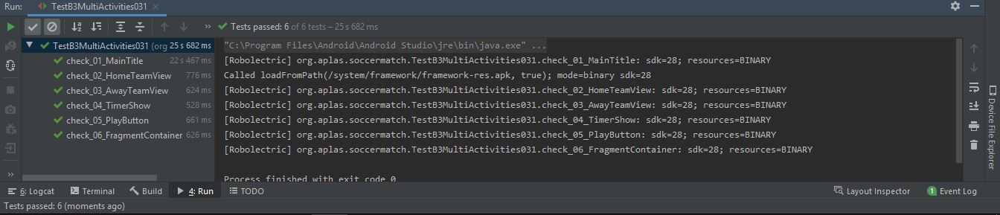

4. Hasil Run TestB3MultiActivities041
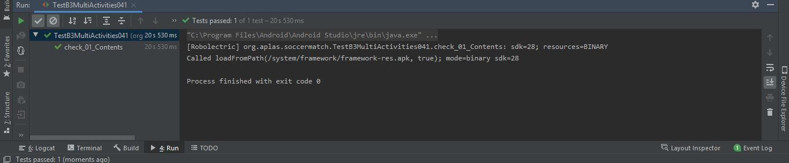

5. Hasil Run TestB3MultiActivities051
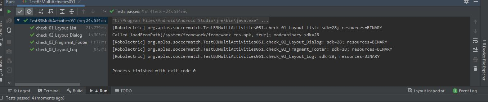

6. Hasil Run TestB3MultiActivities061
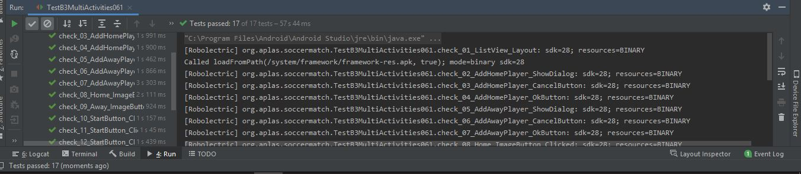

7. Hasil Run TestB3MultiActivities071
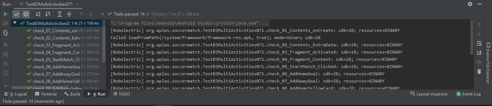

8. Hasil Run TestB3MultiActivities081
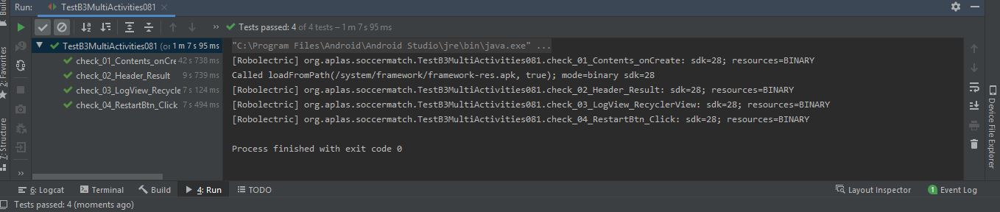

9. Hasil Akhir
## Hasil 1

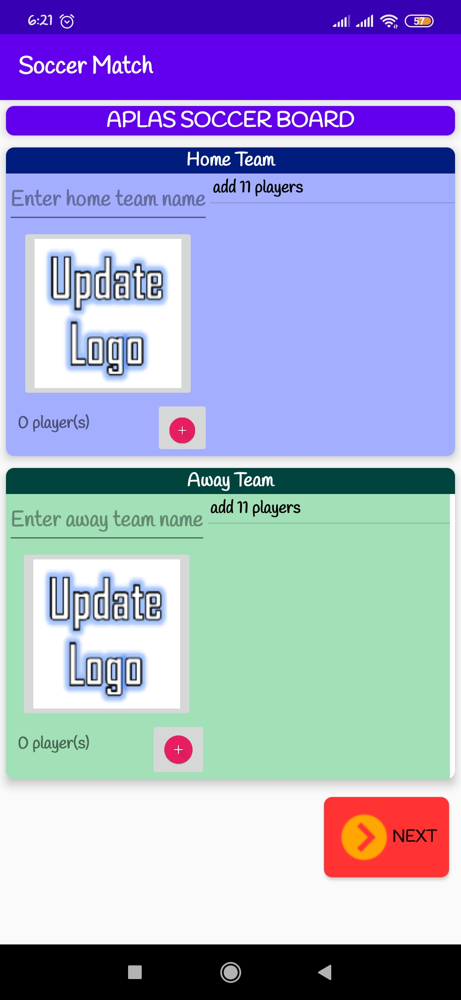

## Hasil 2

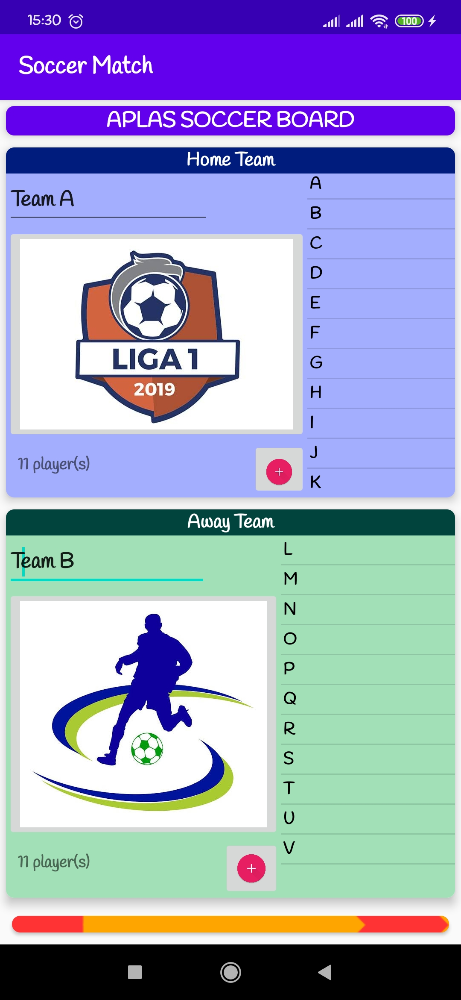

## Hasil 3

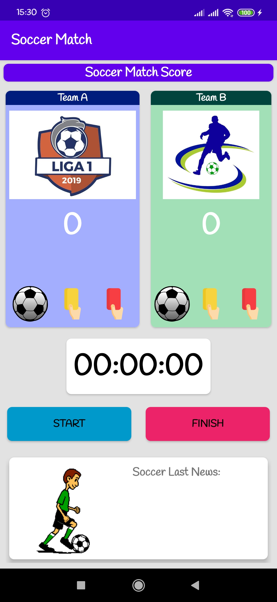

## Hasil 4

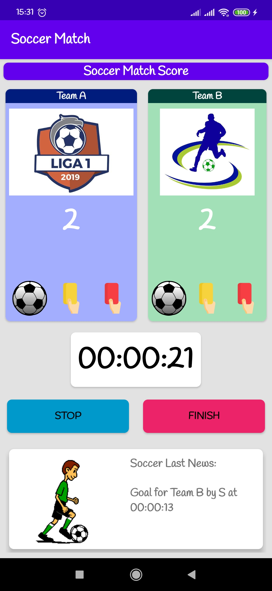

## Hasil 5

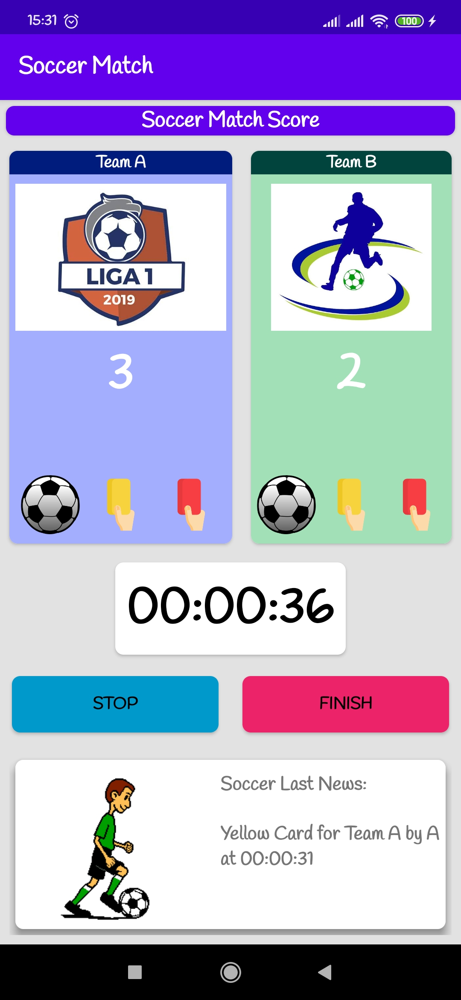

## Hasil 6

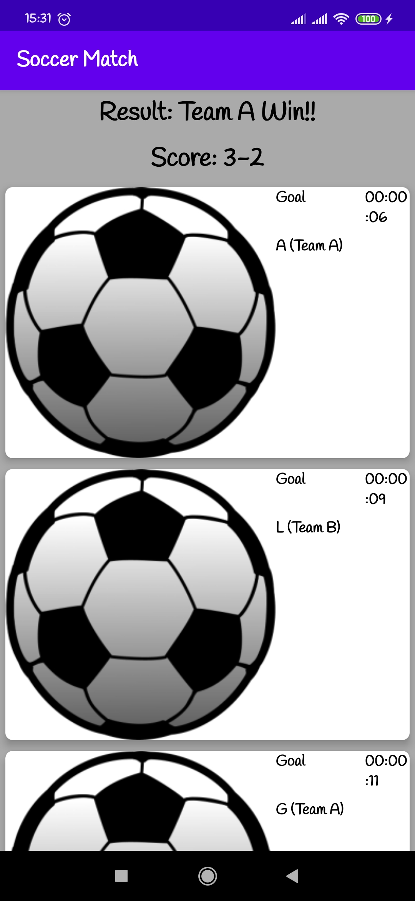

## Hasil 7

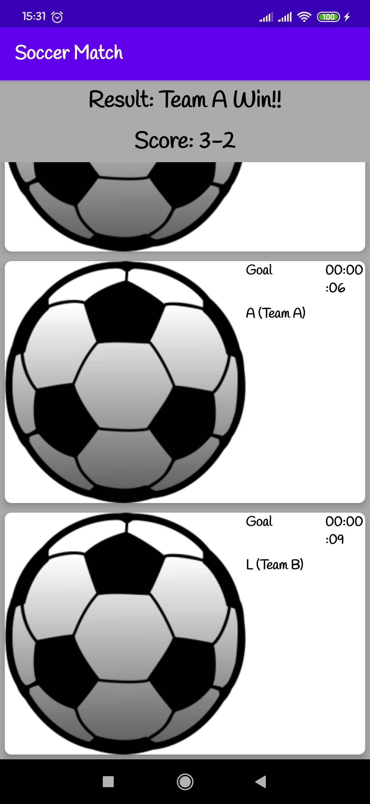

(Lampirkan screenshot hasil praktik di sini selengkap mungkin sesuai tujuan pembelajaran yang ingin dicapai)
