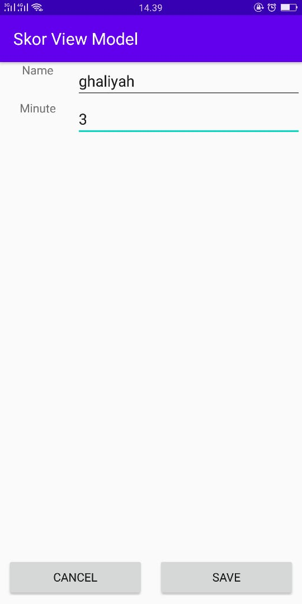

# 09  

## Tujuan Pembelajaran

1. Mahasiswa mengenal tentang arsitektur mvvm
2. Mahasiswa memahami lifecycle viewmodel pada mvvm.
3. Mahasiswa mampu menerapkan viewmodel pada android.

## Hasil Praktikum

1. Hasil 1

2. Hasil 2

3. Hasil 3

(Lampirkan screenshot hasil praktik di sini selengkap mungkin sesuai tujuan pembelajaran yang ingin dicapai)
