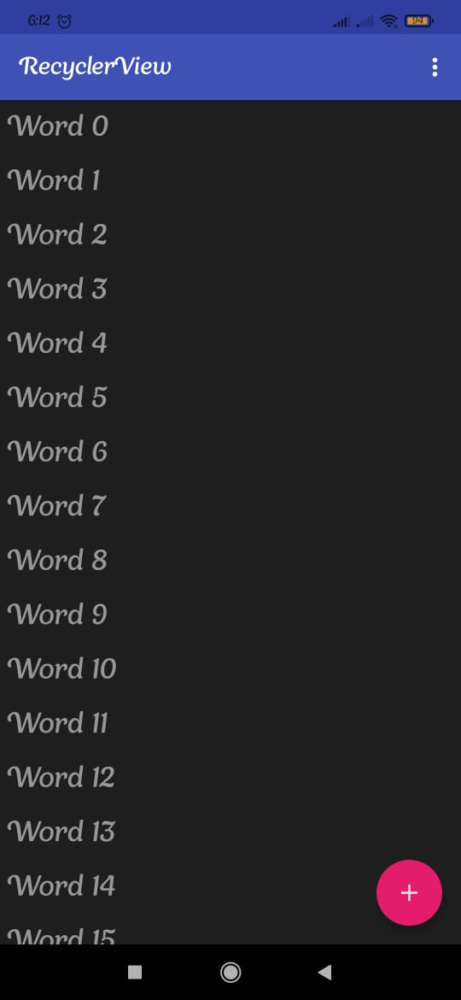
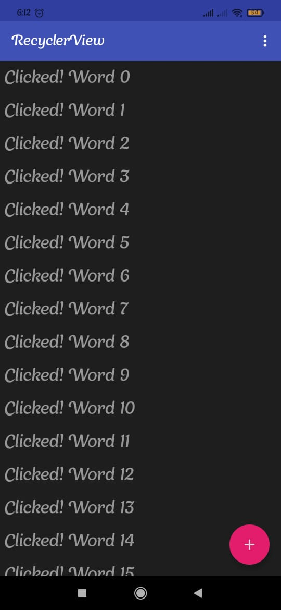
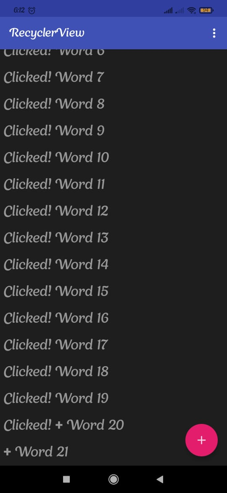

# 11

## Tujuan Pembelajaran

1. Pengenalan Recycler View.
2. Menambahkan Recycler View ke Project Android.
3. Menampilkan data dari Room Persistence.
4. Membuat ViewHolder
5. Menampilkan Detail Data.
6. Refactor OnBindViewHolder
7. Refactor onCreateViewHolder
8. Diff Util
9. Grid Layout
10. Linear Layout
11. On Click Listener pada Recyclerview
12. Navigasi pada On Click
13. Header pada Recyclerview

## Hasil Praktikum

1. Hasil 1

2. Hasil 2

3. Hasil 3

(Lampirkan screenshot hasil praktik di sini selengkap mungkin sesuai tujuan pembelajaran yang ingin dicapai)
