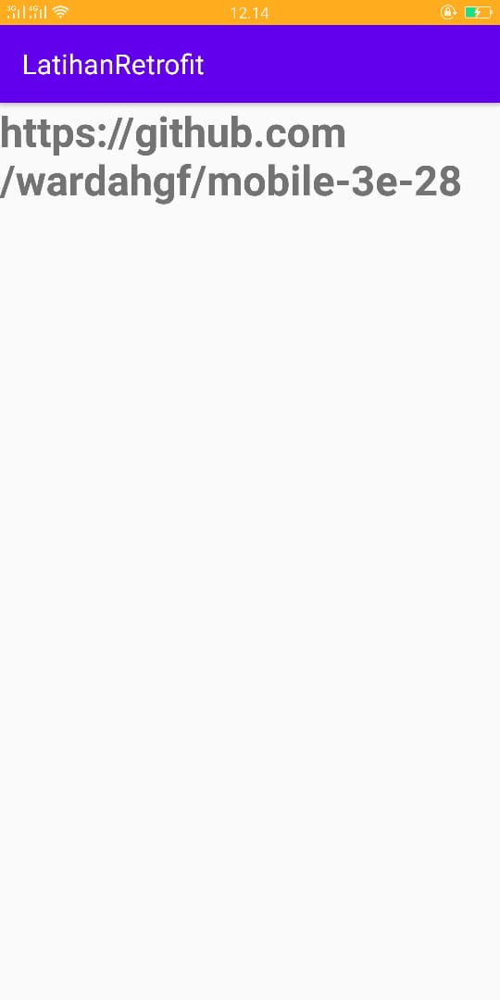

# 12

## Tujuan Pembelajaran

1. Pengenalan Recycler View.
2. Menambahkan Recycler View ke Project Android.
3. Menampilkan data dari Room Persistence.

## Hasil Praktikum

1. Hasil 1

(Lampirkan screenshot hasil praktik di sini selengkap mungkin sesuai tujuan pembelajaran yang ingin dicapai)
