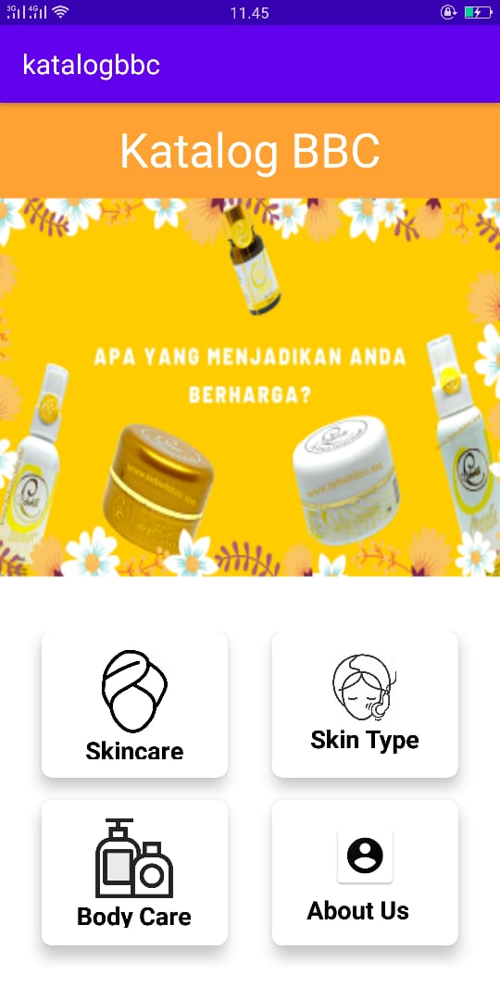
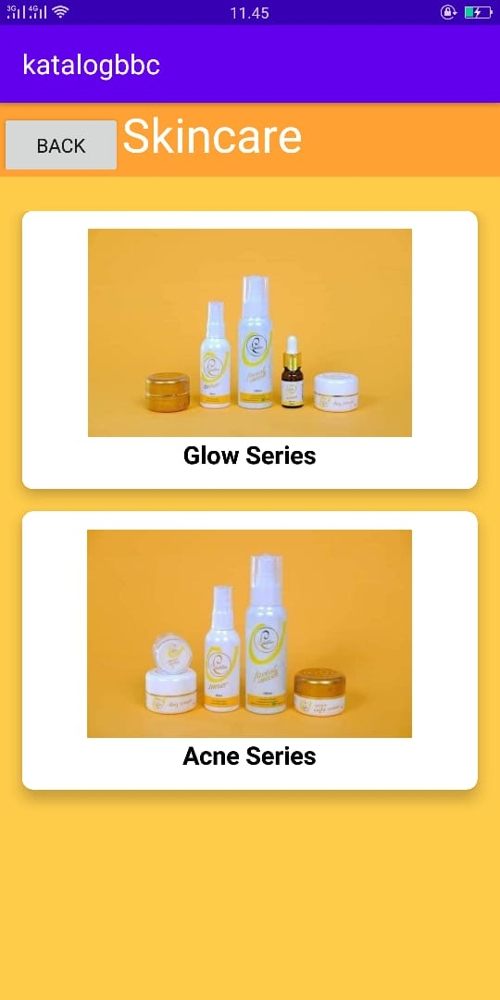
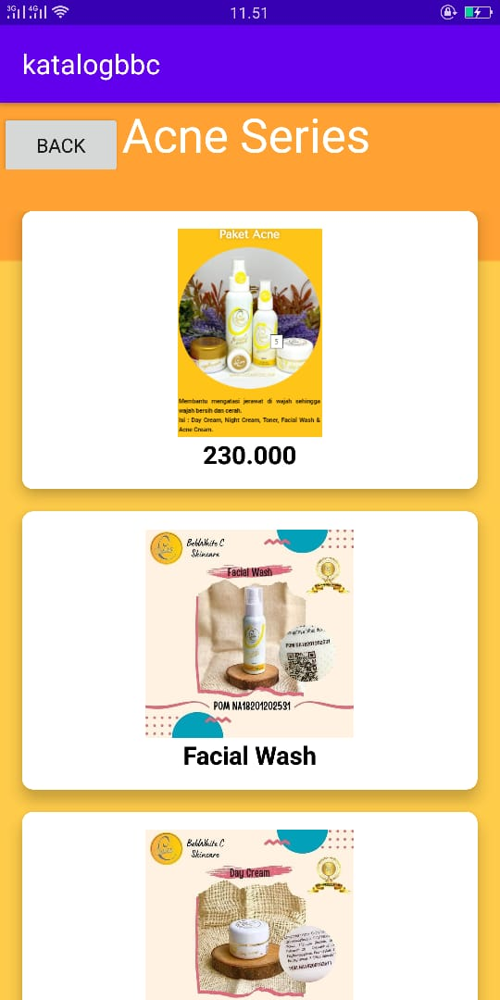
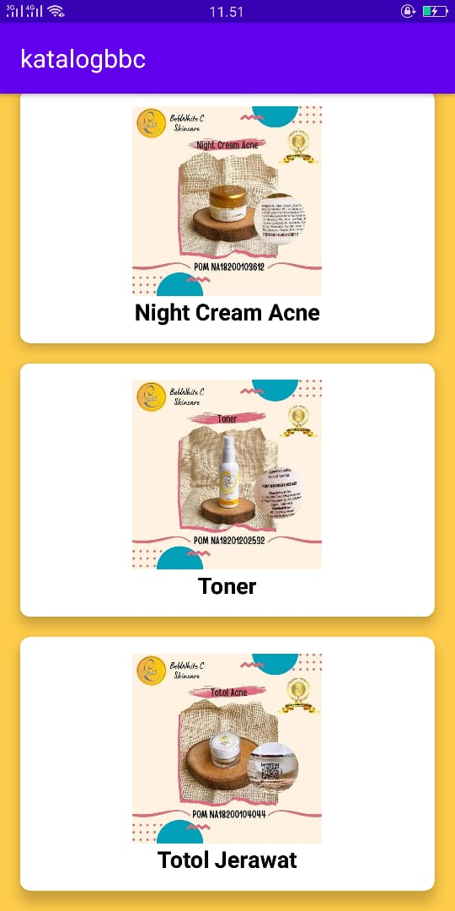
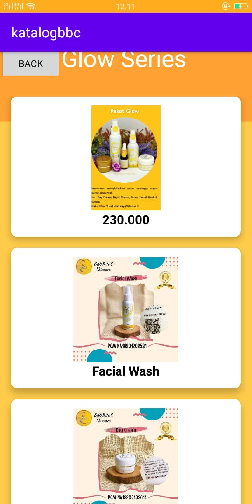
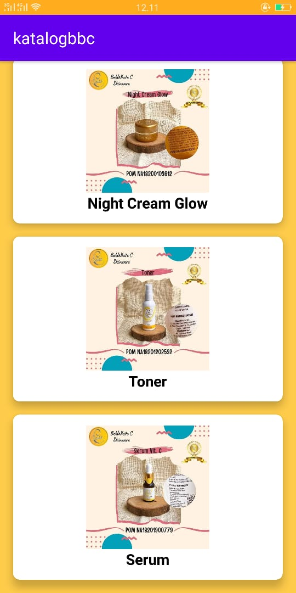
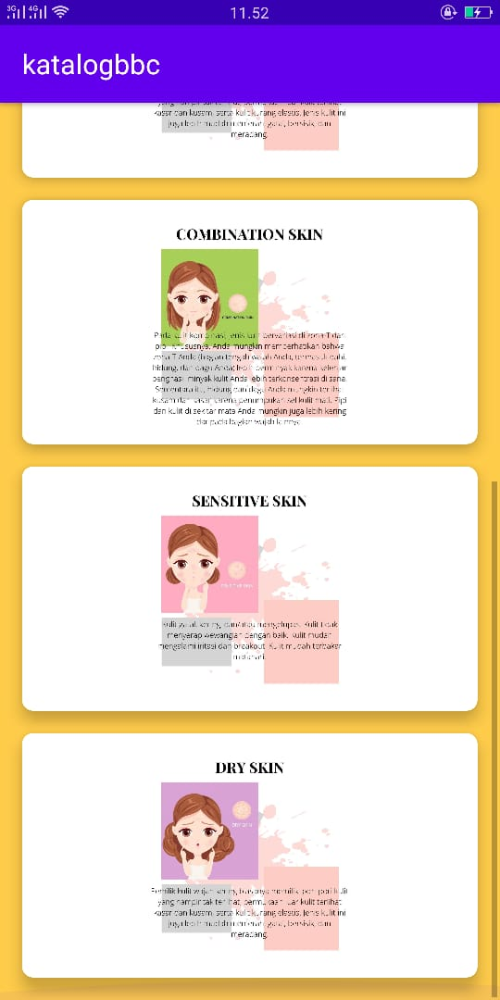
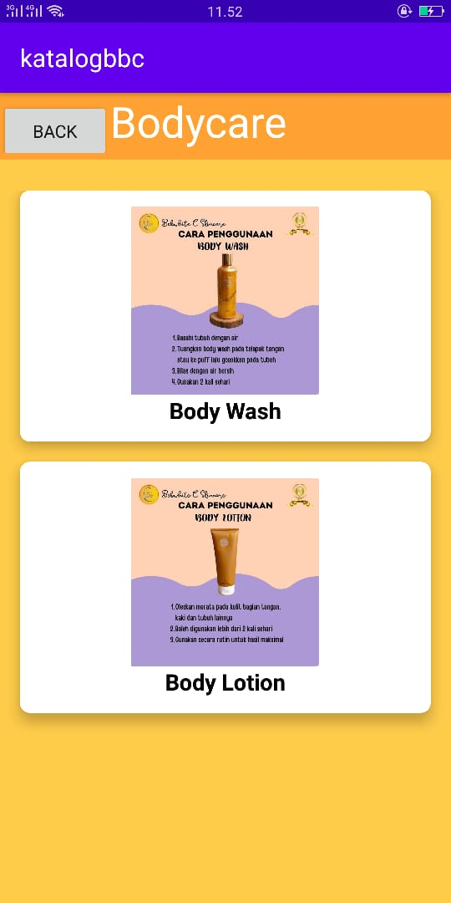

# 13 UAS

Format Laporan Project Akhir (Tugas Besar)

Mata Kuliah : Pemrograman Mobile, Jurusan Teknologi Informasi, Polinema

Dosen Pengampu : Habibie Ed Dien, S.Kom., M.T.

Tahun Ajaran : Semester Ganjil 2020/2021

# Petunjuk
A. Petunjuk Pengerjaan
1. Gunakan format laporan ini untuk dokumen markdown (.md) yang ada di folder docs
pada repository GitHub Anda masing-masing. Lakukan push dari PC/Laptop Anda.

2. Setelah file markdown dibuat, silakan submit tautan/link (.md) ke LMS yang telah
disediakan sebagai Laporan Project Akhir Anda.

# Format Laporan
B. Format Laporan – Markdown (.md)

# Judul Aplikasi
Judul Aplikasi yang dibuat : "Katalog Skincare BBC"

(isikan nama aplikasi Anda di sini. Tambahkan tautan/link APK Signed dan source code di sini dari folder src Anda. Beri keterangan bahasa pemrograman yang digunakan.)

# Deskripsi
Aplikasi "Katalog BBC" dibuat karena Perawatan wajah dan badan adalah salah satu hal yang paling penting yang harus dijaga sebaik mungkin, apabila masalah pada wajah dan badan tidak di jaga dengan baik maka akan terjadi gangguan seperti kulit kering, berjerawat, flek, serta masalah lainnya yang bisa muncul. Namun pada saat ini, banyak sekali yang membutuhkan pengetahuan lebih tentang pentingnya perawatan kulit wajah dan badan.

### Identitas Diri :

|  |  |
|--|--|
| NIM | **1841720029** |
| Nama Lengkap | **Wardah Ghaliyah F** |
| Kelas | TI-3E |

Deskripsi Aplikasi (jelaskan fungsi dan tujuan aplikasi Anda dibuat di sini)
Indentitas Pengembang (Developer)

(Cantumkan NIM, Nama, Kelas. Jika berkelompok, maka tulis identitas partner Anda juga di sini)

# Fitur-fitur Aplikasi
Fitur-fitur Aplikasi

1. Fitur Menu Utama

2. Fitur Skincare

3. Fitur Acne Series

4. Fitur Glow Series

5. Fitur Menu Skin Type

6. Fitur Menu Body Care

7. Fitur About Us

(Jelaskan fitur-fitur yang ada pada Aplikasi Anda beserta screenshot layar, termasuk mulai dari splash screen – jika ada; sampai menu About atau Informasi)

# Saran
Saran:

1. menambahkan Fitur Login dan Register.
2. Menambahkan Fitur Q n A seputar kesehatan dan perawatan kulit
3. Menambahkan Fitur Contact Person untuk order 

(Beri saran pengembangan selanjutnya untuk aplikasi Anda atau ada fitur-fitur yang belum Anda selesaikan bisa dijelaskan di sini)

# Kesimpulan
Kesimpulan:

Dengan adanya aplikasi ini, maka perlu aplikasi yang bisa membantu  dan memenuhi kebutuhan tersebut dan juga rekomendasi produk yang cocok untuk dipakai. 

(Buat kesimpulan secara menyeluruh selama Anda merancang dan membangun aplikasi,
misalnya hal-hal yang Anda pelajari, bagian yang bermanfaat, dsb.)

# Sumber Data (Referensi)
Sumber Data/Referensi:

1. Referensi Aplikasi
- La Tulipe Cosmetics

(cantumkan sumber data untuk konten aplikasi Anda di sini, jika perlu cantumkan juga
sumber belajar Anda selama proses pengembangan aplikasi Anda)
